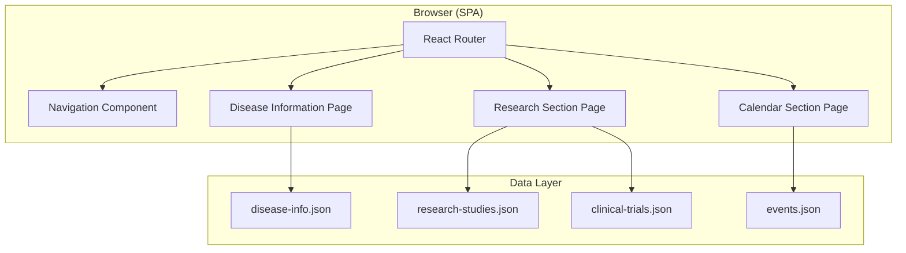
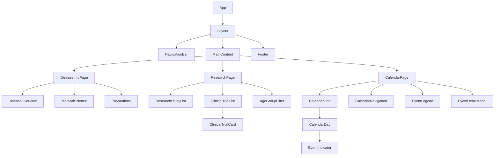

# Design Document: Stargardt Disease Website

## Overview

This design describes the architecture and technical approach for a Stargardt Disease informational and resource-tracking web application. The site serves patients, caregivers, and researchers by providing educational content, research/clinical trial information with age-group filtering, and an events calendar for upcoming trials, medicines, and FDA approvals.

The application is a client-side rendered single-page application (SPA) built with React and TypeScript. Content is managed through a local JSON data layer, making it straightforward to update without a backend CMS. The site prioritizes accessibility (WCAG 2.1 Level AA) and responsiveness across all device sizes.

### Key Design Decisions

| Decision | Choice | Rationale |
|----------|--------|-----------|
| Framework | React + TypeScript | Strong accessibility ecosystem, type safety, component reuse |
| Styling | CSS Modules with CSS custom properties | Scoped styles, easy theming for contrast compliance |
| Routing | React Router | Standard SPA navigation, good a11y support with focus management |
| Data layer | Static JSON files | No backend needed, easy to update, fast loading |
| Calendar | Custom component | Avoids third-party accessibility issues, full control over ARIA |
| Testing | Vitest + React Testing Library + fast-check | Fast unit tests, accessible queries, property-based testing |
| Build tool | Vite | Fast dev/build, TypeScript support out of the box |

## Architecture



The application follows a page-based routing model with three primary routes:

1. `/` or `/disease-info` — Disease Information Section
2. `/research` — Research and Clinical Trials Section
3. `/calendar` — Upcoming Events Calendar Section

Each page component fetches its data from static JSON files bundled with the application. Filtering and sorting logic runs entirely on the client.

## Components and Interfaces

### Component Hierarchy



### Core Component Interfaces

```typescript
// Navigation
interface NavigationProps {
  currentPath: string;
  links: NavLink[];
}

interface NavLink {
  label: string;
  path: string;
  ariaLabel: string;
}

// Disease Information
interface DiseaseInfoSection {
  id: string;
  title: string;
  content: string;
  terms: GlossaryTerm[];
}

interface GlossaryTerm {
  term: string;
  definition: string;
}

interface PrecautionItem {
  id: string;
  category: 'uv-exposure' | 'dietary' | 'lifestyle';
  text: string;
}

// Research
interface ResearchStudy {
  id: string;
  title: string;
  institution: string;
  status: 'recruiting' | 'active' | 'completed';
  summary: string; // max 300 chars
  lastUpdated: string; // ISO date
}

interface ClinicalTrial {
  id: string;
  name: string; // max 150 chars
  phase: string;
  eligibilitySummary: string; // max 200 chars
  location: string;
  detailsUrl: string;
  ageRange: {
    min: number;
    max: number;
  };
}

type AgeGroup = 'pediatric' | 'adult' | 'senior';

interface AgeGroupDefinition {
  id: AgeGroup;
  label: string;
  minAge: number;
  maxAge: number;
}

// Calendar
interface CalendarEvent {
  id: string;
  name: string;
  type: 'clinical-trial-milestone' | 'medicine-release' | 'fda-approval';
  date: string; // ISO date
  description: string; // max 500 chars
}

interface CalendarState {
  currentMonth: number; // 0-indexed
  currentYear: number;
  selectedEvent: CalendarEvent | null;
}
```

### Key Component Behaviors

**NavigationBar**
- Renders all nav links on viewports ≥ 768px
- Collapses into a hamburger menu on viewports < 768px
- Highlights the active route via `aria-current="page"`
- Manages focus when toggling mobile menu (focus trap within expanded menu)

**AgeGroupFilter**
- Renders filter buttons for each age group plus an "All" option
- Uses `aria-pressed` to indicate active filter
- Triggers re-render of ClinicalTrialList with filtered data
- Filtering logic: a trial appears under an age group if `trial.ageRange.min <= ageGroup.maxAge AND trial.ageRange.max >= ageGroup.minAge`

**CalendarGrid**
- Renders a monthly grid with day cells
- Each day cell contains event indicators (colored dots/icons)
- Supports keyboard navigation (arrow keys between days)
- Announces selected date and events via `aria-live` region

**EventDetailModal**
- Displays event details in an accessible modal (dialog role)
- Traps focus within modal when open
- Closes on Escape key or close button activation
- Returns focus to triggering element on close

## Data Models

### Age Group Definitions

```typescript
const AGE_GROUPS: AgeGroupDefinition[] = [
  { id: 'pediatric', label: 'Pediatric (0–17)', minAge: 0, maxAge: 17 },
  { id: 'adult', label: 'Adult (18–64)', minAge: 18, maxAge: 64 },
  { id: 'senior', label: 'Senior (65+)', minAge: 65, maxAge: 150 },
];
```

### Calendar Navigation Bounds

```typescript
const CALENDAR_BOUNDS = {
  pastMonths: 3,   // months into the past from current date
  futureMonths: 12, // months into the future from current date
};
```

### Data File Schemas

**disease-info.json**
```json
{
  "overview": {
    "definition": "...",
    "symptoms": "...",
    "progression": "..."
  },
  "medicalScience": {
    "geneticBasis": "...",
    "biologicalMechanism": "...",
    "inheritancePatterns": "..."
  },
  "precautions": [
    { "id": "p1", "category": "uv-exposure", "text": "..." },
    { "id": "p2", "category": "dietary", "text": "..." },
    { "id": "p3", "category": "lifestyle", "text": "..." }
  ],
  "glossary": [
    { "term": "ABCA4", "definition": "..." },
    { "term": "lipofuscin", "definition": "..." }
  ]
}
```

**research-studies.json**
```json
[
  {
    "id": "rs-001",
    "title": "...",
    "institution": "...",
    "status": "recruiting",
    "summary": "...",
    "lastUpdated": "2024-06-15"
  }
]
```

**clinical-trials.json**
```json
[
  {
    "id": "ct-001",
    "name": "...",
    "phase": "Phase 2",
    "eligibilitySummary": "...",
    "location": "...",
    "detailsUrl": "https://...",
    "ageRange": { "min": 12, "max": 65 }
  }
]
```

**events.json**
```json
[
  {
    "id": "evt-001",
    "name": "...",
    "type": "fda-approval",
    "date": "2025-03-15",
    "description": "..."
  }
]
```

### Filtering Logic

The age-group filtering function determines which trials belong to a given age group:

```typescript
function filterTrialsByAgeGroup(
  trials: ClinicalTrial[],
  ageGroup: AgeGroupDefinition
): ClinicalTrial[] {
  return trials.filter(
    (trial) =>
      trial.ageRange.min <= ageGroup.maxAge &&
      trial.ageRange.max >= ageGroup.minAge
  );
}
```

A trial with `ageRange: { min: 12, max: 65 }` would appear under both "Pediatric" and "Adult" groups because the range overlaps both.

### Calendar Date Utilities

```typescript
function isWithinCalendarBounds(
  targetMonth: number,
  targetYear: number,
  currentDate: Date
): boolean {
  const target = new Date(targetYear, targetMonth, 1);
  const earliest = new Date(
    currentDate.getFullYear(),
    currentDate.getMonth() - CALENDAR_BOUNDS.pastMonths,
    1
  );
  const latest = new Date(
    currentDate.getFullYear(),
    currentDate.getMonth() + CALENDAR_BOUNDS.futureMonths,
    1
  );
  return target >= earliest && target <= latest;
}

function getEventsForMonth(
  events: CalendarEvent[],
  month: number,
  year: number
): CalendarEvent[] {
  return events.filter((event) => {
    const d = new Date(event.date);
    return d.getMonth() === month && d.getFullYear() === year;
  });
}
```


## Correctness Properties

*A property is a characteristic or behavior that should hold true across all valid executions of a system — essentially, a formal statement about what the system should do. Properties serve as the bridge between human-readable specifications and machine-verifiable correctness guarantees.*

### Property 1: Flesch-Kincaid Grade Level Computation

*For any* text input consisting of at least one sentence and one word, the Flesch-Kincaid Grade Level function SHALL produce a numeric result equal to `0.39 * (totalWords / totalSentences) + 11.8 * (totalSyllables / totalWords) - 15.59`, and the disease information content SHALL produce a grade level at or below 8.0.

**Validates: Requirements 1.3**

### Property 2: Glossary Term Coverage

*For any* disease information content and any glossary term that appears within that content, the rendered output SHALL include a definition or explanation for that term at or before its first point of use.

**Validates: Requirements 1.4, 2.4**

### Property 3: Precaution Category Validation

*For any* valid set of precaution items, the validation function SHALL return true if and only if the set contains at least one item categorized as "uv-exposure", at least one as "dietary", and at least one as "lifestyle", and the total count is at least 5.

**Validates: Requirements 3.1, 3.2**

### Property 4: Precaution Sentence Length Constraint

*For any* precaution item text, the text SHALL contain no more than 2 sentence-ending punctuation marks (periods, exclamation marks, or question marks that end a sentence), ensuring each item is at most 2 sentences long.

**Validates: Requirements 3.3**

### Property 5: Research Study Filtering and Sort Order

*For any* list of research studies with various `lastUpdated` dates and a reference "today" date, the filtered result SHALL include only studies whose `lastUpdated` is within the last 12 months from today, AND the result SHALL be sorted in descending order by `lastUpdated` (most recent first).

**Validates: Requirements 4.1**

### Property 6: Age Group Filtering Correctness

*For any* clinical trial with an age range `[min, max]` and any age group with bounds `[groupMin, groupMax]`, the trial SHALL appear in the filtered results for that age group if and only if `trial.min <= groupMax AND trial.max >= groupMin`. Consequently, trials spanning multiple age groups SHALL appear under each applicable group.

**Validates: Requirements 5.1, 5.3, 5.7**

### Property 7: Calendar Navigation Bounds

*For any* target month/year and a reference current date, the `isWithinCalendarBounds` function SHALL return `true` if and only if the target month is no more than 3 months before the current month and no more than 12 months after the current month.

**Validates: Requirements 6.3**

### Property 8: Active Navigation Link Determination

*For any* valid route path in the application, the navigation component SHALL mark exactly one link as active (via `aria-current="page"`), and that link SHALL correspond to the section matching the current path.

**Validates: Requirements 7.2**

### Property 9: WCAG Contrast Ratio Calculation

*For any* pair of colors (foreground, background) expressed as RGB values, the computed contrast ratio SHALL equal `(L1 + 0.05) / (L2 + 0.05)` where L1 is the relative luminance of the lighter color and L2 is the relative luminance of the darker color, following the WCAG 2.1 relative luminance formula.

**Validates: Requirements 8.2**

## Error Handling

| Scenario | Behavior | User Feedback |
|----------|----------|---------------|
| Disease info data fails to load | Show error state component | "Content is temporarily unavailable. Please try again later." |
| Precautions content fails to load | Show error message in precautions area | "Precaution information is temporarily unavailable. Please retry later." (Req 3.5) |
| Research studies data is empty | Show informational message | "No current studies are available at this time." (Req 4.4) |
| No trials for selected age group | Show informational message | "No trials are currently available for this age group." (Req 5.6) |
| No events for displayed month | Show message in calendar area | "No events are scheduled for this month." (Req 6.7) |
| Event detail fails to load | Close modal, show toast notification | "Could not load event details. Please try again." |
| Navigation fails (broken route) | Redirect to home page | 404 page with link back to home |

### Error Handling Strategy

- **Data loading errors**: Each page component wraps data fetching in an error boundary. On failure, a friendly message is displayed with a retry action.
- **Graceful degradation**: If one section's data fails, other sections remain functional.
- **No silent failures**: Every error state produces visible user feedback.
- **Accessibility of errors**: Error messages use `role="alert"` or `aria-live="assertive"` to ensure screen reader announcement.

## Testing Strategy

### Unit Tests (Vitest + React Testing Library)

Unit tests cover specific examples, edge cases, and component rendering:

- **Disease Information Page**: Verify three subsections render, glossary tooltips appear, precaution list renders with correct structure
- **Research Section**: Verify study cards display all required fields, empty state messages appear correctly
- **Clinical Trials**: Verify trial cards render all fields, initial load shows all trials, filter buttons render
- **Calendar**: Verify monthly grid renders correct number of days, current date is highlighted, event indicators appear on correct days
- **Navigation**: Verify links render on desktop, hamburger menu works on mobile, active state is applied
- **Error states**: Verify error boundaries display appropriate messages
- **Accessibility**: Run axe-core in each test to verify zero automated violations

### Property-Based Tests (fast-check)

Property-based tests validate universal correctness properties with minimum 100 iterations each:

| Property | Test Description | Tag |
|----------|------------------|-----|
| 1 | Generate random text, verify FK formula computes correctly | Feature: stargardt-disease-website, Property 1: FK grade level computation |
| 2 | Generate content with random terms from glossary, verify definitions present | Feature: stargardt-disease-website, Property 2: Glossary term coverage |
| 3 | Generate random precaution sets, verify category validation | Feature: stargardt-disease-website, Property 3: Precaution category validation |
| 4 | Generate random precaution texts, verify sentence count ≤ 2 | Feature: stargardt-disease-website, Property 4: Precaution sentence length |
| 5 | Generate random study lists with dates, verify filter+sort correctness | Feature: stargardt-disease-website, Property 5: Research study filtering and sort |
| 6 | Generate random trial age ranges and age groups, verify overlap logic | Feature: stargardt-disease-website, Property 6: Age group filtering correctness |
| 7 | Generate random target dates, verify bounds checking | Feature: stargardt-disease-website, Property 7: Calendar navigation bounds |
| 8 | Generate random route paths, verify exactly one active link | Feature: stargardt-disease-website, Property 8: Active navigation link |
| 9 | Generate random RGB color pairs, verify contrast ratio formula | Feature: stargardt-disease-website, Property 9: Contrast ratio calculation |

### Integration Tests

- **Accessibility audit**: Run axe-core across all pages in a headless browser
- **Keyboard navigation**: Automated tab-through tests verifying focus order and no traps
- **Responsive layout**: Visual regression tests at 320px, 768px, 1024px, and 1920px viewports
- **Screen reader compatibility**: Manual testing with VoiceOver/NVDA

### Test Configuration

```typescript
// vitest.config.ts
export default defineConfig({
  test: {
    environment: 'jsdom',
    setupFiles: ['./src/test/setup.ts'],
    coverage: {
      provider: 'v8',
      reporter: ['text', 'html'],
    },
  },
});
```

```typescript
// Property test example structure
import { fc } from 'fast-check';
import { describe, it, expect } from 'vitest';

describe('Property: Age group filtering correctness', () => {
  it('trial appears in group iff age ranges overlap', () => {
    // Feature: stargardt-disease-website, Property 6: Age group filtering correctness
    fc.assert(
      fc.property(
        fc.integer({ min: 0, max: 100 }), // trial min age
        fc.integer({ min: 0, max: 150 }), // trial max age
        fc.integer({ min: 0, max: 100 }), // group min age
        fc.integer({ min: 0, max: 150 }), // group max age
        (trialMin, trialMax, groupMin, groupMax) => {
          fc.pre(trialMin <= trialMax);
          fc.pre(groupMin <= groupMax);
          const trial = { ageRange: { min: trialMin, max: trialMax } };
          const group = { minAge: groupMin, maxAge: groupMax };
          const included = filterTrialsByAgeGroup([trial], group).length > 0;
          const shouldBeIncluded = trialMin <= groupMax && trialMax >= groupMin;
          expect(included).toBe(shouldBeIncluded);
        }
      ),
      { numRuns: 100 }
    );
  });
});
```
